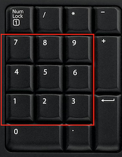
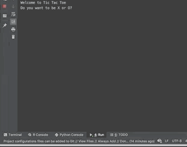

# TicTacToe
This is a text-based (non-graphic) tic tac toe game coded in python. It was written in summer 2019 to self-learn python. 
The user chooses a game piece (by typing 'x' or 'o' when prompted), than the player who plays first is chosen randomly. User than play against the computer. In each turn, the player has to choose the location in the grid to place their piece (the grid is enumerated 1-9 like on a number pad):

The program is implemented with a basic tic tac toe algorithm designed so that computer will always try to find the best move to beat the player.

